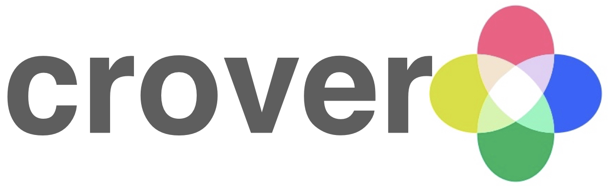

キーワードを入力し、それと同時にTwitterでつぶやかれている言葉のクラスタリングと、それらが含まれるツイートの感情分析を行うwebアプリケーション

# Environment
- Google Cloud Platform AppEngine
- Python 3.9
- Flask 2.0.1

# App URL
https://crover-word-ocean.uc.r.appspot.com/

# Function
1. Twitter APIにより、入力されたキーワードを含む直近のツイートを取得します。
2. 得られたツイートを[Sudachipy](https://github.com/WorksApplications/SudachiPy)
   を用いて分かち書き（単語・品詞分類）します。それらの単語は頻出順に大きくWordCloudとして表示されます。
3. WordCloudの下の「感情分析」ボタンを押すと、[pymlask](https://github.com/ikegami-yukino/pymlask)
によって、ルールベースでそれらの単語を含むツイートをポジティブ・ニュートラル・ネガティブの３つに分類します。
4. WordCloudの下の「分ける」ボタンを押すと、単語に割り当てられたベクトル（word2vec）に基づいて階層的クラスタリングが行われ、WordCloudが分割されます。

# License
GPL v3

# Author
Naoya Furuhashi  
https://twitter.com/snooze_jelly

